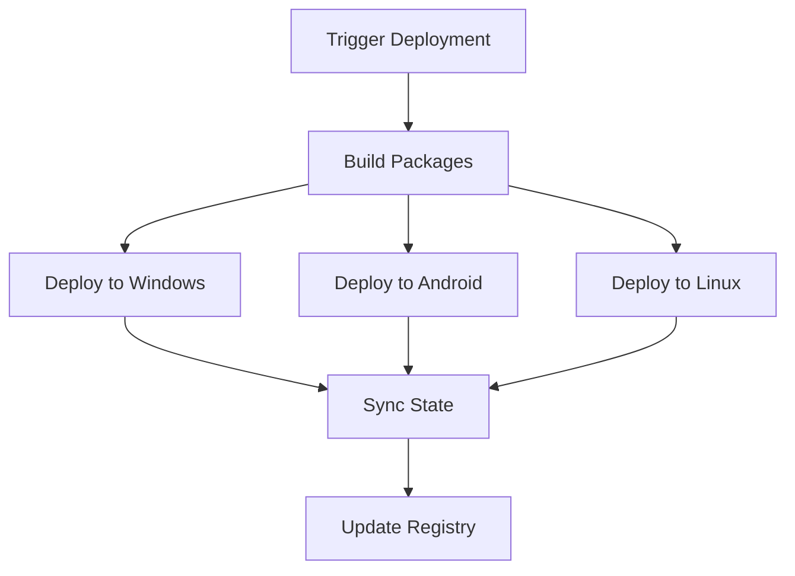

<!-- HEADY_BRAND:BEGIN
<!-- ╔══════════════════════════════════════════════════════════════════╗
<!-- ║  ██╗  ██╗███████╗ █████╗ ██████╗ ██╗   ██╗                     ║
<!-- ║  ██║  ██║██╔════╝██╔══██╗██╔══██╗╚██╗ ██╔╝                     ║
<!-- ║  ███████║█████╗  ███████║██║  ██║ ╚████╔╝                      ║
<!-- ║  ██╔══██║██╔══╝  ██╔══██║██║  ██║  ╚██╔╝                       ║
<!-- ║  ██║  ██║███████╗██║  ██║██████╔╝   ██║                        ║
<!-- ║  ╚═╝  ╚═╝╚══════╝╚═╝  ╚═╝╚═════╝    ╚═╝                        ║
<!-- ║                                                                  ║
<!-- ║  ∞ SACRED GEOMETRY ∞  Organic Systems · Breathing Interfaces    ║
<!-- ║  ━━━━━━━━━━━━━━━━━━━━━━━━━━━━━━━━━━━━━━━━━━━━━━━━━━━━━━━━━━━━━━━━  ║
<!-- ║  FILE: docs/HCFP_AUTO_DEPLOYMENT.md                                                    ║
<!-- ║  LAYER: docs                                                  ║
<!-- ╚══════════════════════════════════════════════════════════════════╝
<!-- HEADY_BRAND:END
-->
# Auto Deployment Guide

## Cross-Device Deployment Process
1. **Build phase**: Platform-specific packages are built
2. **Deployment phase**: Packages deployed to target devices
3. **Synchronization**: State synced across all devices
4. **Verification**: Deployment status recorded in registry



## Verification
After deployment, check:
- `deployments/latest.json`
- Service status on all devices
- Cross-device synchronization status

## Automatic Deployment Setup

To enable fully automated deployments:

1. Run the scheduled task setup script:
   ```powershell
   .\scripts\setup-auto-deploy-task.ps1
   ```

2. The task will run daily at 3 AM and perform:
   - System health checks
   - User activity verification
   - Multi-platform deployment
   - State synchronization
   - Deployment registry update

3. Safety mechanisms:
   - Aborts if system health check fails
   - Skips non-critical targets on failure
   - Verifies deployments after each step
